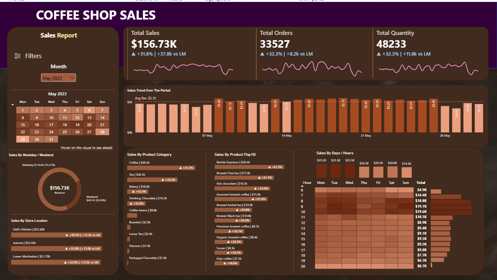

# Coffee Shop Sales Analysis

> An end-to-end sales analysis using MySQL and Power BI to explore revenue performance, product performance, store locations, and sales trends over time.

`SQL` · `MYSQL` · `POWER BI` · `DAX` · `DATA ANALYSIS` · `DATA VISUALIZATION`

---

## Project Overview

This project analyzes transactional sales data from a coffee shop business using **MySQL and Power BI**.

The project begins with data preparation in SQL, where transaction dates and times were cleaned and converted into appropriate data types. SQL was then used to analyze key business metrics including **total sales, total orders, quantity sold, month-over-month growth, daily sales performance, store performance, product performance, and hourly sales patterns**.

The cleaned data was then used in **Power BI** to build an interactive sales dashboard, using DAX measures and dynamic filtering to explore performance across different dates, store locations, products, and time periods.

The project combines SQL analysis with business intelligence and visualization to provide a complete view of coffee shop sales performance.

---

## Business Questions

The analysis was designed to answer the following questions:

- What are the key sales KPIs, including **total sales, total orders, and total quantity sold**?
- How are sales, orders, and quantity changing **month over month**?
- How does each day's sales performance compare with the **average daily sales**?
- How does sales performance differ between **weekdays and weekends**?
- Which **store locations** generate the highest sales?
- Which **product categories and product types** contribute the most revenue?
- Which are the **Top 10 product types** by sales?
- How do sales vary across different **days of the week**?
- At what **hours of the day** does the coffee shop generate the most sales?
- How do sales KPIs change when analyzing a **specific date, weekday, or hour**?

---

## Data Preparation & SQL Analysis

The project began in **MySQL**, where the transactional data was prepared and analyzed before being brought into Power BI.

### Data Preparation

The `transaction_date` and `transaction_time` columns were initially stored as text and were converted into proper **DATE** and **TIME** data types.

This made it possible to perform reliable time-based analysis using functions such as `MONTH()`, `DAY()`, `DAYOFWEEK()`, and `HOUR()`.

### SQL Analysis

After preparing the data, SQL was used to analyze several areas of sales performance:

- **Sales KPIs** — total sales, total orders, and total quantity sold
- **Month-over-Month Performance** — sales, orders, and quantity growth using `LAG()`
- **Daily Sales Performance** — daily revenue and comparison against average daily sales
- **Store Performance** — sales contribution by store location
- **Product Performance** — sales by product category and Top 10 product types
- **Weekday vs Weekend Performance** — comparison of sales across different parts of the week
- **Time Analysis** — sales performance by day of week and hour of day
- **Selected-Period Analysis** — KPI calculations for specific dates, weekdays, and hours

---

## Power BI Dashboard

After completing the SQL analysis, the sales data was brought into **Power BI** to create an interactive dashboard for exploring coffee shop performance.

The dashboard focuses on three main KPIs:

- **Total Sales**
- **Total Orders**
- **Total Quantity Sold**

Each KPI is supported by **month-over-month performance indicators**, making it possible to compare current performance with the previous month.

### Dashboard Analysis

The report includes visual analysis of:

- Daily sales, orders, and quantity trends
- Sales by weekday vs weekend
- Sales performance by store location
- Sales by product category
- Top-performing product types
- Daily sales compared with average daily sales
- Sales by day of the week
- Sales by hour of the day
- Day and hour sales patterns
- Month-based filtering for interactive analysis

The dashboard also uses custom tooltips to provide additional context when exploring daily and hourly sales performance.

### Dashboard Preview

<p align="center">
  
</p>

---

## DAX Measures

DAX was used to create dynamic KPIs and month-over-month comparisons within the Power BI dashboard.

Some of the main measures include:

### Total Sales

```DAX
Total Sales =
SUMX(
    cssales,
    cssales[transaction_qty] * cssales[unit_price]
)
```

### Previous Month Sales

```DAX
Previous Month Sales =
CALCULATE(
    [Total Sales],
    DATEADD(
        cssales[transaction_date],
        -1,
        MONTH
    )
)
```

### Month-over-Month Sales Change

```DAX
MoM Increase Percentage =
VAR month_diff =
    [Total Sales] - [Previous Month Sales]

VAR mom_increase =
    DIVIDE(month_diff, [Previous Month Sales])

VAR sign_ =
    IF(month_diff > 0, "+", "")

VAR sign_trend =
    IF(month_diff > 0, "▲", "▼")

RETURN
    sign_trend & " "
        & sign_
        & FORMAT(mom_increase, "#0.0%")
        & " | "
        & sign_
        & FORMAT(month_diff / 1000, "0.0k")
        & " vs LM"
```

The same month-over-month approach was applied to the other main KPIs, allowing the dashboard to show both the **percentage change and absolute difference from the previous month**.

---

## Key Insights

- The coffee shop generated **$698.81K in total revenue** from **149,116 orders** and **214,470 items sold** across the analyzed period.

- Sales showed strong growth throughout the period. Monthly revenue increased from **$81.68K in January to $166.49K in June**, representing an increase of approximately **104%**. Orders grew from **17,314 to 35,352**, while quantity sold increased from **24,870 to 50,942**, showing that revenue growth was largely supported by higher transaction volume.

- Growth remained positive toward the end of the period. In **May, sales increased by 31.8% month over month**, while orders and quantity sold both increased by **32.3%**. Growth continued in **June**, with sales increasing another **6.2%**, orders by **5.4%**, and quantity by **5.6%** compared with May.

- Store performance was highly balanced. **Hell's Kitchen generated $236.51K**, Astoria **$232.24K**, and Lower Manhattan **$230.06K**. The small gap between locations suggests that overall growth was not dependent on a single store.

- **Coffee remained the dominant product category**, generating approximately **$270K**, followed by **Tea at $196.4K**. Together, the two categories contributed roughly **two-thirds of total revenue**.

- The product mix remained relatively stable as the business grew. Coffee generated approximately **$31.3K in January** and **$64.8K in June**, while Tea increased from **$22.6K to $46.2K**. Both categories roughly doubled alongside overall revenue rather than one category becoming the main driver of growth.

- **Barista Espresso was the highest-performing product type overall at $91.4K**. It also remained a leading product at store level, generating approximately **$32.4K in Hell's Kitchen** and **$27.9K in Astoria**.

- Customer activity was strongly concentrated in the **morning hours**. Across the full period, **10 AM generated the highest hourly revenue at approximately $88.7K**, with 8–10 AM forming the strongest sales window. Revenue dropped sharply after the morning peak and remained substantially lower throughout the afternoon and evening.

- The morning pattern remained visible at both ends of the period rather than appearing only as sales increased. In **January, 9–10 AM generated around $10K per hour**, while by **June the same period generated roughly $20K–$21K per hour**, showing that growth amplified an existing purchasing pattern.

- **Weekdays consistently generated around 72% of revenue**, compared with roughly 28% from weekends. This distribution remained similar between January and June, suggesting that the overall growth did not significantly change the weekly purchasing pattern.

---

## Business Recommendations

Based on the sales patterns identified in the analysis:

- **Prioritize staffing and inventory during the morning peak.** Sales are heavily concentrated between **8 AM and 10 AM**, with 10 AM generating the highest hourly revenue. Stores should ensure sufficient staffing and stock availability during this period to handle peak demand efficiently.

- **Use slower afternoon and evening periods for targeted promotions.** Sales decline considerably after the morning peak. Time-specific offers, bundles, or loyalty incentives could be tested during lower-demand hours to encourage additional purchases without discounting during already strong periods.

- **Protect availability of Coffee and Tea products.** These two categories generate roughly **two-thirds of total revenue**, making stockouts particularly costly. Inventory planning should prioritize their ingredients and the products associated with them.

- **Leverage top-selling products in bundles and cross-selling strategies.** Products such as **Barista Espresso, Brewed Chai Tea, and Hot Chocolate** consistently rank among the strongest performers and could be paired with lower-performing food or beverage items to increase average transaction value.

- **Maintain a consistent strategy across locations while monitoring local differences.** Revenue is remarkably balanced between Hell's Kitchen, Astoria, and Lower Manhattan, suggesting there is no major underperforming store requiring immediate intervention. Resources can instead focus on improving performance across all three locations.

- **Target weekday demand while exploring weekend growth opportunities.** Weekdays consistently account for roughly **72% of revenue**. Weekend-specific promotions or product bundles could be tested to determine whether the lower weekend contribution represents an opportunity for incremental sales.

- **Prepare capacity for continued growth.** Revenue increased from **$81.68K in January to $166.49K in June**, while orders and quantity sold grew alongside it. If this trajectory continues, staffing, inventory levels, and operational capacity should be reviewed to ensure they can support higher transaction volumes.

---

## Tools & Skills Demonstrated

| Area | Skills |
|---|---|
| **MySQL** | Data cleaning, data type conversion, aggregations, filtering, date & time analysis |
| **SQL** | Subqueries, window functions, `LAG()`, conditional logic, KPI & MoM analysis |
| **Power BI** | Interactive dashboard development, data visualization, slicers, filtering, tooltips |
| **DAX** | Measures, time intelligence, variables, conditional logic, MoM calculations, dynamic KPI indicators |
| **Data Analysis** | Sales trends, product performance, store comparison, time-based demand analysis |
| **Business Analytics** | Identifying performance drivers and translating insights into business recommendations |

---

## Repository Structure

```text
Coffee-Shop-Sales-Analysis/
│
├── README.md
├── coffee_shop_sales_analysis.sql
├── coffee_shop_sales_dashboard.pbix
│
└── assets/
    └── coffee-shop-dashboard.png
```

### Files

- **`coffee_shop_sales_analysis.sql`** — SQL data preparation and sales analysis queries.
- **`coffee_shop_sales_dashboard.pbix`** — Interactive Power BI dashboard and DAX measures.
- **`assets/coffee-shop-dashboard.png`** — Preview of the completed Power BI dashboard.

---

## Conclusion

This project demonstrates an end-to-end approach to sales analysis, starting with **data preparation and exploration in MySQL** and continuing through **DAX calculations, interactive reporting, and visualization in Power BI**.

The analysis identified strong growth across the period while showing that the underlying business remained relatively stable across **store locations, product mix, and weekly purchasing patterns**. The clearest differences appeared in **time-of-day demand and product performance**, with morning hours and the Coffee and Tea categories contributing heavily to overall sales.

Beyond reporting performance, the findings were translated into practical recommendations around **staffing, inventory planning, product strategy, promotions, and operational capacity**.
